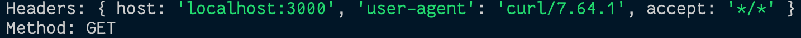
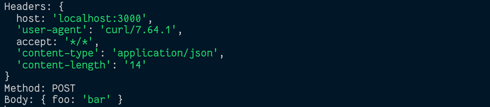

# Network Protocols

- IP
- TCP
- HTTP

## Setup & Run

One terminal: (Server)

```bash
npm install # Express
node server.js
```

The other terminal: (Client)

**GET**

```bash
curl localhost:3000/hello
```

_Response:_



**POST**

```bash
curl --header 'content-type: application/json' localhost:3000/hello --data '{"foo": "bar"}'
```

_Response:_



**Note:** The content-length (the length of the body) is specified in this response.

## HTTP - Request-Response paradigm

### Request

- headers
  - host:port
  - path
- method
- body

### Response

- status code
- headers
- body
